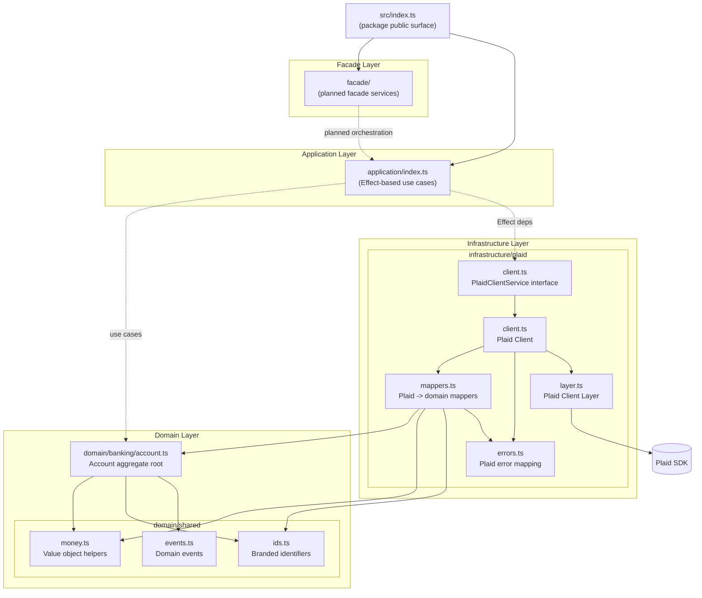

# @udmada/finance-client

Personal finance domain toolkit with Plaid integration, built to showcase DDD, Effect, and event-driven patterns, part of the Simplicity take-home test.

## Features

<details open>
  <summary><strong>Domain-Driven Design focus</strong></summary>
  
  - aggregates
  - value objects
  - domain events
  - open-banking narratives

</details>

<details>
  <summary><strong>Functional-programming inspired</strong></summary>
  <p>Fully typed Effects as business logic—typing as guardrails; composable by desin.</p>
</details>

<details open>
  <summary><strong>Plaid-as-a-hot-plug</strong></summary>

- client wrapper
- error mapper
- DTO -> domain
- dependency injection layer
- provider-agnostic

</details>

<details >
  <summary><strong>Modern packaging</strong></summary>
  
  - Dual ESM/CommonJS export
  - typed entry points
  - strict linting
  - publishing-ready structure

</details>

## Installation

```bash
pnpm add @udmada/finance-client effect plaid
```

The package targets Node LTS (tested on Node@24). ESM is the default entry point; CommonJS consumers use the `require` subpath automatically.

## Exports

| Import Path                             | Description                             |
| --------------------------------------- | --------------------------------------- |
| `@udmada/finance-client`                | Domain models, value objects, events    |
| `@udmada/finance-client/effect`         | Effect application services             |
| `@udmada/finance-client/infrastructure` | Plaid client, mappers, errors, DI layer |

## [Architecture](docs/architecture.md)

<details open>
<summary>Arch diagram in mermaid</summary>



</details>

<details>
  <summary>Arch diagram in SVG</summary>
 <picture>
   <source srcset="./docs/images/finance-client-architecture-dark.svg"
           media="(prefers-color-scheme: dark)" />
   <source srcset="./docs/images/finance-client-architecture-light.svg"
           media="(prefers-color-scheme: light)" />
   
 </picture>

</details>

## Usage

```ts
import { PlaidClient, PlaidClientLayer } from "@udmada/finance-client/infrastructure";
import { Effect, Layer } from "effect";

const layer = PlaidClientLayer({
  clientId: process.env.PLAID_CLIENT_ID!,
  secret: process.env.PLAID_SECRET!,
  environment: "sandbox",
});

const program = Effect.flatMap(PlaidClient.accountsGet({ access_token: "test" }), (response) =>
  Effect.log(response.accounts.length),
);

await Layer.toRuntime(layer).pipe(
  Effect.flatMap((runtime) => Effect.promise(() => runtime.runPromise(program))),
);
```
