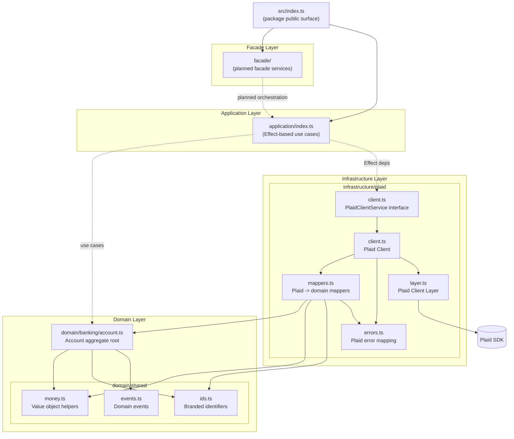

# @udmada/finance-client Architecture

## Notes

- **Domain** holds value objects and aggregates used across the package.
- **Infrastructure** wraps the Plaid SDK with typed errors, mappers, and Effect-based services.
- **Effect/Application/Facade** folders are scaffolds for future use cases and orchestrations.
- `index.ts` re-exports domain and infrastructure so consumers have a single entry point.
